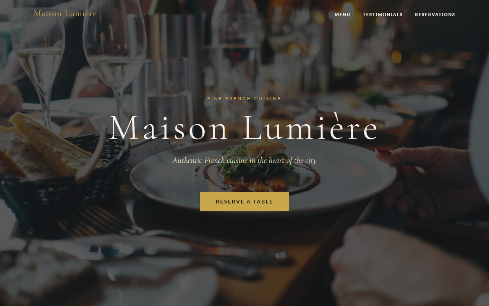

# Kungfu Panda

A single-page luxury Chinese restaurant website with authentic Hunan cuisine and online reservation enquiry, built with vanilla HTML, CSS, and JavaScript — no frameworks, no build tools.

**Live site:** https://fishbatu8.github.io/frenchrestaurant/



---

## Features

- Full-viewport hero with red lanterns photography and cinematic gradient overlay
- Menu section with 9 Hunan dishes across 3 categories (前菜 Starters, 主菜 Signatures, 甜品 Desserts)
- Luxury Chinese palette — deep cinnabar crimson, burnished gold, lacquer & parchment
- Cinzel + Cormorant Garamond typography for refined, authentic feel
- Auto-rotating testimonials carousel
- Client-side reservation form with inline validation (11:30 – 22:00 time slots)
- Fully responsive (desktop / tablet / mobile)
- Accessible — keyboard navigable, ARIA labels, focus management

## Project Structure

```
├── index.html        # All markup
├── styles.css        # All styling and design tokens
├── script.js         # All behaviour (nav, carousel, form validation)
├── screenshot.png    # Live site screenshot
└── .github/
    └── workflows/
        └── deploy.yml   # GitHub Actions → GitHub Pages
```

## Running Locally

Open `index.html` directly in a browser — no server or install step needed.

```
file:///C:/Users/<you>/path/to/index.html
```

## Deployment

Pushes to `main` automatically deploy to GitHub Pages via the included GitHub Actions workflow.
